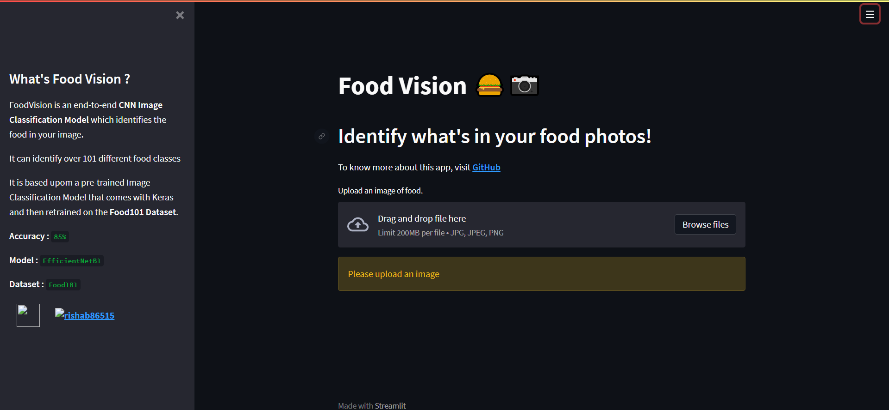

# Food Vision :hamburger: :camera:

This an end-to-end **CNN Image Classification Model** which identifies the food in your image. 

I worked out with a pre-trained Image Classification Model that comes with Keras and then retrained it on the **Food101** Dataset.

### Fun Fact 

The Model actually beats the [**DeepFood**](https://arxiv.org/pdf/1606.05675.pdf) Paper's model which also trained on the same dataset.

The Accuracy aquired by DeepFood was **77.4%** and our model's **85%** . Difference of **8%** ain't much, but the interesting thing is, DeepFood's model took **2-3 days** to train while our's barely took **90min**.

> ##### **Dataset used :**  **`Food101`**

> ##### **Model Used :** **`EfficientNetB1`**

> ##### **Accuracy :** **`85%`**

## Looks Great, How can I use it ?

Finally after training the model, I have exported it as `.hdf5` files and then integrated it with **Streamlit Web App**. 

**Streamlit** turns data scripts into shareable web apps in minutes. 
Once I got the App working on my local device I then deployed it using Streamlit’s invite-only **[sharing feature](https://streamlit.io/sharing)**

### To view the Deployed app, [Click here](https://share.streamlit.io/rishab86515/food_101/main/app.py)

> The app may take a couple of seconds to load for the first time, but it works perfectly fine.

Once an app is loaded, 

1. Upload an image of food. If you dont have one, use the images from `food-images/`
2. Once the image is processed, **`Predict`** button appears. Click it.
3. Once you click the **`Predict`** button, the model prediction takes place and the output will be displayed along with the model's **Top-5 Predictions**
4. And voilà, there you go.

## Okay Cool, How did you build it ?

> If you actually want to know the Nuts and Bolts how the model was trained check out **[`model-training.ipynb`](https://github.com/Rishab86515/Food_101/blob/main/food_vision.ipynb) Notebook**

1. #### Imported Food101 dataset from **[Tensorflow Datasets](https://www.tensorflow.org/datasets)** Module.

2. #### Data Visualization : 

3. ### Preprocessing the data

4. #### Building the Model Callbacks 

   As we are dealing with a complex Neural Network (EfficientNetB0) its a good practice to have few callbacks set up. Few ones I will be using throughtout this Notebook are :

   - **TensorBoard Callback :** TensorBoard provides the visualization and tooling needed for machine learning experimentation

   - **ModelCheckpoint :** Saves saves our model's progress at various intervals so we can load it and resuse it later without having to retrain it

   - **EarlyStoppingCallback :** Used to stop training when a monitored metric has stopped improving.

   - **ReduceLROnPlateau :** Reduce learning rate when a metric has stopped improving.

5. #### Setup Global dtype policy to **`mixed_float16`** to implement Mixed Precision Training

   > Mixed precision is the use of both 16-bit and 32-bit floating-point types in a model during training to make it **run faster** and use **less memory**.

5. #### Built a Fine Tuning Model

   This part tool the longest. In Deep Learning, you have to know which nob does what. Once yoy get experienced you'll what nobs you should turn to get the results you want. 
   **Architecture** : **`EffficientNetB1`**
   

6. #### Evaluating and Deploying out Model to Streamlit

   Using different ways to evaluate our model

   Once we are satisfied with the results, we can export the model as a `.hdf5`  which can be used in future for model deployment.

Once the model is exported then there comes the Deployment part. Check out  **[`app.py`](https://github.com/Rishab86515/Food_101/blob/main/app.py)** to get more insight on How I integrated it with Streamlit.

